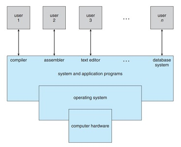

# Introduction

## Need for an Operating System

<h3> An Operating System Acting as an Intermediate between User and Hardware </h3>

 
 

## Uses of Operating System
- make it easier for the user to use the computer to its full capacity
- allocate resoures efficiently and providing a smooth exprience to the users
- having a control on the CPU and Timing management to manage processes

## Major Responsibilities of the Operating System

- Process Management
- Memory Management
- Storage Management
- Protection and Security
 