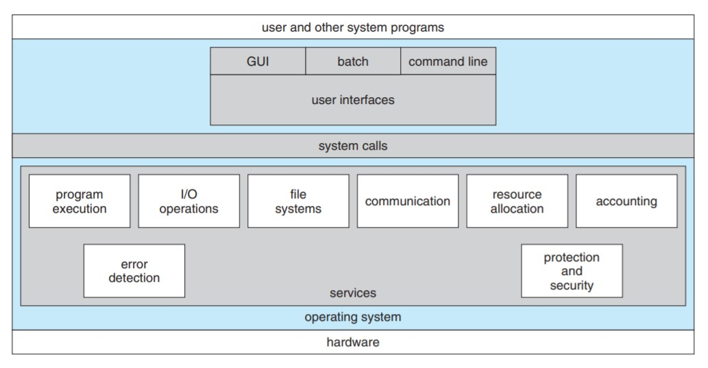

# Process Management

## Tasks under Process Management

- Scheduling processes and threads on the CPUs
- Creating and deleting both user and system processes
- Suspending and resuming processes
- Providing mechanisms for process synchronization
- Providing mechanisms for process communication

 

<h3>Operating System Services</h3>

