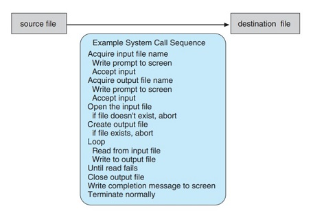

# System Calls

***System Calls*** are simply ways of interacting with the services made available by the operating system.

 

- Generally available as routines written in C and C++
- Written in Assembly Language if direct hardware access is needed
- APIs are created to make the life of an application programmer easy
- An API specifies a set of functions that are available to an application programmer
- They also include the parameters that are passed to each function and the return values the programmer can expect
- Behind the scenes, the functions that make up an API typically invoke the
actual system calls on behalf of the application programmer

 

----

 

### How System Calls are executed for copying data from one file to another.

## Types of System Calls

- Process Control
  - end,abort
  - load, execute
  - create process, terminate process
  - get process attributes, set process attributes
  - wait for time
  - wait event, signal event
  - allocate memory,free memory
- File Manipulation
  - create file, delete file
  - open, close
  - read, write, reposition
  - get file attributes, set file attributes
- Device Manipulation
  - request device, release device
  - read, write, reposition
  - get device attributes, set device attributes
  - logically attach or detach devices
- Information Maintenance
  - get time or date, set time or date
  - get system data, set system data
  - get process, file or device attributes, set process, file or device attributes 
- Communications
  - create, delete communication connection
  - send, recieve messages
  - transfer status information
  - attach or detach remote devices
- Protection

